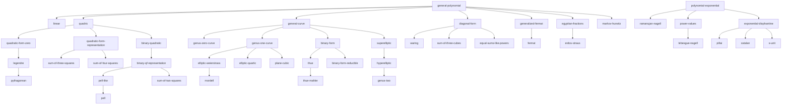

# Families of Diophantine equations

A prioritized enumeration of families for the Diophantine Library, and the source of
truth behind the machine-readable registry
([`diophantine_classifier/data/families.yaml`](../diophantine_classifier/data/families.yaml))
that drives the classifier.

**What counts as a family.** A parametrized collection of equations that is treated
uniformly in the literature: it has a standard form, a body of theory describing its
solution sets (finiteness, structure, effectivity), and ideally an algorithm or at
least a named method. Families form a DAG under specialization (Pell ⊂ Pell-like ⊂
binary quadratic forms ⊂ conics), and the classifier reports the *most specific*
family containing a given equation, together with its ancestors.

**Fields.** Each entry records: the standard form (unknowns are Latin letters near
the end of the alphabet or as displayed; parameters are the remaining letters), the
solvability status, the main methods, software that solves or partially solves the
family, and one or two key references. The YAML registry mirrors these fields.

**Status vocabulary.**

- `solved` — complete description of all solutions (possibly a parametrization).
- `algorithmic` — a terminating algorithm exists and is implemented in standard software.
- `effective` — finiteness with effectively computable bounds (usually Baker's method);
  practical algorithms exist for moderate parameters but may need per-instance work.
- `ineffective` — finiteness known (Thue–Siegel–Roth, subspace theorem, Faltings) with
  no general algorithm; individual instances handled by descent/Chabauty/modularity.
- `partial` — solved for sub-ranges of parameters or conditionally.
- `open` — status of the solution set is a named open problem.

**Priorities.** `P1` = launch set for the Diophantine Library (well-understood theory,
existing software, high query volume); `P2` = second wave (needs more infrastructure
or number-field input); `P3` = aspirational / research-level exhibits.

Solutions are sought in ℤ (or ℕ where stated) throughout; rational-point versions are
noted where they differ. Number-field and S-integer generalizations exist for nearly
every family and are deferred to per-family notes, matching the site plan (first ℤ
and ℚ, eventually number fields and S-integers).

---

## 1. Linear equations and lattice problems

### `linear` — Linear Diophantine equation — P1, solved
**Form.** a₁x₁ + ⋯ + a_k x_k = b.
**Status.** Solvable iff gcd(a₁,…,a_k) ∣ b; solution set is a coset of a rank-(k−1)
lattice, computed by the extended Euclidean algorithm / Hermite normal form.
**Software.** Sage: `xgcd`, `matrix(ZZ,...).hermite_form()`, `solve_diophantine`;
PARI: `matsolvemod`; every CAS.
**References.** Classical (Bachet 1621, Euler). See Niven–Zuckerman–Montgomery ch. 5.

### `linear-system` — Systems of linear equations over ℤ — P1, solved
**Form.** Ax = b, A ∈ ℤ^{m×k}.
**Status.** Complete theory via Smith normal form; solution set empty or a lattice coset.
**Software.** Sage: `A.smith_form()`, `A.solve_right()` + `A.right_kernel()`;
PARI: `matsnf`, `matsolvemod`.
**References.** Smith 1861; Cohen, *A Course in Computational Algebraic Number Theory*, §2.4.

### `frobenius` — Frobenius / numerical semigroup membership — P2, algorithmic
**Form.** a₁x₁ + ⋯ + a_k x_k = b with x_i ≥ 0, gcd(aᵢ) = 1.
**Status.** Membership decidable; Frobenius number g(a₁,…,a_k) closed-form only for
k = 2 (Sylvester: a₁a₂ − a₁ − a₂); computing it is NP-hard for varying k, polynomial
time for fixed k (Kannan 1992).
**Software.** GAP package `numericalsgps`; Sage `NumericalSemigroup` (via GAP).
**References.** Ramírez Alfonsín, *The Diophantine Frobenius Problem* (2005).

---

## 2. Quadratic equations

### `binary-quadratic` — General binary quadratic — P1, algorithmic
**Form.** ax² + bxy + cy² + dx + ey + f = 0.
**Status.** Completely algorithmic (Lagrange, Gauss). Behavior governed by
D = b² − 4ac: D < 0 finite; D = 0 reduces to squares-and-linear; D > 0 nonsquare
reduces to Pell-like (finitely many families of solutions from fundamental
automorph); D > 0 square factors.
**Transformations.** Completing the square: (2ax + by + d)² − D(y + t)² = s form;
unimodular reduction of the quadratic part.
**Software.** Sage: `solve_diophantine` (sympy), `BinaryQF`; PARI: `qfbsolve`,
`qfbred`; Alperin's and Matthews' online solvers; Magma quadratic forms machinery.
**References.** Gauss, *Disquisitiones*; Lagrange 1768; Matthews,
"The Diophantine equation ax²+bxy+cy² = N" (J. Théor. Nombres Bordeaux 14, 2002).

### `binary-qf-representation` — Representation by a binary quadratic form — P1, algorithmic
**Form.** ax² + bxy + cy² = n (n ≠ 0).
**Status.** Algorithmic via reduction theory and class-group structure; definite
forms: finitely many representations (Cornacchia); indefinite: finitely many orbits
under the automorph group.
**Software.** Sage: `BinaryQF(a,b,c).solve_integer(n)`; PARI: `qfbsolve`,
`qfbcornacchia`.
**References.** Cox, *Primes of the form x²+ny²*; Cornacchia 1908.

### `sum-of-two-squares` — Sum of two squares — P1, solved
**Form.** x² + y² = n.
**Status.** Solvable iff v_p(n) even for all p ≡ 3 (mod 4) (Fermat, Euler);
representation count via r₂(n) (Jacobi); fast algorithms via Cornacchia / Gaussian
integer gcd (Rabin–Shallit randomized polynomial time).
**Software.** Sage: `two_squares(n)`; PARI: `qfbcornacchia(1,p)`.
**References.** Fermat 1640; Rabin–Shallit 1986.

### `pell` — Pell equation — P1, solved
**Form.** x² − Dy² = ±1, D > 0 nonsquare.
**Status.** Infinitely many solutions forming ⟨fundamental solution⟩ × {±1};
fundamental solution from the continued fraction of √D (period parity decides the
−1 case). Regulator-size caveat: the fundamental solution can be exponentially
large in √D; compact representations exist.
**Software.** Sage: `continued_fraction`, `QuadraticField(D).unit_group()`;
PARI: `quadunit`; Magma: `FundamentalUnit`.
**References.** Lagrange 1768; Lenstra, "Solving the Pell equation," Notices AMS 49 (2002).

### `pell-like` — Generalized Pell equation — P1, algorithmic
**Form.** x² − Dy² = N (D > 0 nonsquare).
**Status.** Finitely many classes of solutions, each an orbit under the Pell
automorph; found via continued fractions / LMM algorithm or quadratic-form class
theory.
**Software.** Sage: `solve_diophantine`; PARI: `qfbsolve(Qfb(1,0,-D), N)`.
**References.** Lagrange–Matthews–Mollin; Matthews, "The Diophantine equation
x²−Dy²=N" (2000); Mollin, *Fundamental Number Theory with Applications*.

### `simultaneous-pell` — Simultaneous Pell equations — P2, effective
**Form.** x² − az² = 1, y² − bz² = 1 (and variants sharing a variable).
**Status.** Finitely many; effective via linear forms in logarithms; at most 3
solutions in many regimes (Bennett); practical resolution via LLL reduction of the
Baker bound.
**Software.** No turnkey solver; scripts on top of Sage/PARI following Anglin/de Weger.
**References.** Anglin 1996; Bennett, "On the number of solutions of simultaneous
Pell equations" (J. reine angew. Math. 498, 1998).

### `legendre` — Legendre / diagonal ternary quadratic — P1, algorithmic
**Form.** ax² + by² + cz² = 0 (nontrivial solutions; usually abc squarefree, mixed signs).
**Status.** Solvability by Legendre's criterion / Hasse–Minkowski; when solvable, a
point of provably small height exists (Holzer) and efficient algorithms find it;
all solutions parametrized from one (stereographic projection).
**Software.** Sage: `Conic([a,b,c]).has_rational_point(point=True)`, `qfsolve`;
PARI: `qfsolve`; Magma: `IsLocallySolvable`, `HasRationalPoint`.
**References.** Legendre 1785; Holzer 1950; Cremona–Rusin, "Efficient solution of
rational conics" (Math. Comp. 72, 2003); Simon 2005 (PARI `qfsolve`).

### `pythagorean` — Pythagorean triples — P1, solved
**Form.** x² + y² = z².
**Status.** Completely parametrized: primitive solutions (m²−n², 2mn, m²+n²),
gcd(m,n)=1, m ≢ n (mod 2). The template example of "solved by parametrization"
(genus 0 with a rational point).
**References.** Euclid, *Elements* X.29; Dickson, *History*, vol. II ch. IV.

### `quadratic-form-zero` — Isotropy of a quadratic form — P1, algorithmic
**Form.** Q(x₁,…,x_k) = 0, Q a nondegenerate integral quadratic form, k ≥ 3.
**Status.** Hasse–Minkowski: solvable iff solvable over ℝ and all ℚ_p (finite
check); k ≥ 5 indefinite always isotropic. Efficient point-finding via
Simon's algorithm (lattice reduction + minimization).
**Software.** Sage: `qfsolve(G)`; PARI: `qfsolve`; Magma: `IsotropicSubspace`.
**References.** Hasse 1923; Cassels, *Rational Quadratic Forms*; Simon,
"Solving quadratic equations using reduced unimodular quadratic forms" (Math. Comp. 74, 2005).

### `quadratic-form-representation` — Representation by a quadratic form, k ≥ 3 — P1, algorithmic
**Form.** Q(x₁,…,x_k) = n.
**Status.** Local-global up to spinor genus (k = 3 subtleties: spinor exceptions;
k ≥ 4: represented iff locally represented, for n large — effective); celebrated
uniform results: 15-theorem (Conway–Schneeberger–Bhargava), 290-theorem
(Bhargava–Hanke). Reduces to `quadratic-form-zero` in k+1 variables via Q(x) − n·t².
**Software.** Sage: `QuadraticForm`, `qfsolve` on Q ⊥ ⟨−n⟩; PARI: `qfminim`,
`qfsolve`; Magma: `RepresentationNumber`, ternary form machinery.
**References.** Cassels; Bhargava 2000; Bhargava–Hanke 2005.

### `sum-of-three-squares` — Three squares — P1, solved
**Form.** x² + y² + z² = n.
**Status.** Solvable iff n ≠ 4^a(8b+7) (Legendre/Gauss); randomized polynomial-time
algorithms (Rabin–Shallit, using class-group/Cornacchia steps).
**Software.** Sage: `three_squares(n)`.
**References.** Legendre 1798, Gauss DA art. 291; Rabin–Shallit 1986.

### `sum-of-four-squares` — Four squares (Lagrange) — P1, solved
**Form.** x² + y² + z² + w² = n.
**Status.** Always solvable (Lagrange 1770); Jacobi's formula counts representations;
randomized polynomial-time algorithms.
**Software.** Sage: `four_squares(n)`.
**References.** Lagrange 1770; Jacobi 1834; Rabin–Shallit 1986.

### `quadric` — General quadratic Diophantine equation — P2, algorithmic
**Form.** Q(x₁,…,x_k) + L(x₁,…,x_k) + c = 0 (arbitrary quadratic, k ≥ 3).
**Status.** Decidable in general — the deepest case of the quadratic theory
(Grunewald–Segal give a general algorithm for orbit problems covering all
quadratics); in practice: complete the square and reduce to
representation/isotropy plus congruences.
**Software.** case-by-case reduction in Sage/PARI (`qfsolve` after completion);
sympy `diophantine` handles some shapes.
**References.** Siegel 1972; Grunewald–Segal, "How to solve a quadratic equation
in integers" (Math. Proc. Camb. Phil. Soc. 89, 1981).

### `congruent-number` — Congruent number problem — P2, partial/open
**Form.** System: x² + y² = z², xy = 2n (n squarefree); equivalently positive rank
of y² = x³ − n²x.
**Status.** Tunnell's criterion decides it assuming BSD; unconditional in neither
direction in general. A flagship "system + elliptic curve bridge" family.
**Software.** Sage/Magma via the elliptic curve rank; Tunnell counts via theta series.
**References.** Tunnell 1983; Koblitz, *Introduction to Elliptic Curves and Modular Forms*.

---

## 3. Cubic equations and genus one

### `elliptic-weierstrass` — Elliptic curve, Weierstrass form — P1, algorithmic*
**Form.** y² + a₁xy + a₃y = x³ + a₂x² + a₄x + a₆.
**Status.** Rational points: finitely generated (Mordell); rank computation via
descent is an algorithm *conditional* on Ш finiteness (hence the asterisk) but
succeeds in practice; integral points: finite (Siegel), effective (Baker), computed
by the elliptic-logarithm method once generators are known.
**Software.** Sage: `EllipticCurve.gens()`, `.integral_points()`, `.S_integral_points()`
(mwrank/eclib inside); PARI: `ellrank`, `ellratpoints`; Magma: `MordellWeilShaInformation`,
`IntegralPoints`.
**References.** Mordell 1922; Siegel 1929; Baker 1968; Gebel–Pethő–Zimmer 1994;
Stroeker–Tzanakis 1994; Cremona, *Algorithms for Modular Elliptic Curves*.

### `mordell` — Mordell equation — P1, algorithmic*
**Form.** y² = x³ + k, k ≠ 0.
**Status.** Finitely many integral points (Mordell/Siegel), effective (Baker;
best bounds Stark, Juricevic); completely tabulated for |k| ≤ 10⁷
(Gebel–Pethő–Zimmer for 10⁴; Bennett–Ghadermarzi for 10⁷).
**Software.** Sage: `EllipticCurve([0,0,0,0,k]).integral_points()`; Magma ditto;
Bennett–Ghadermarzi online tables.
**References.** Mordell 1913; Gebel–Pethő–Zimmer, "On Mordell's equation" (Compositio 110, 1998);
Bennett–Ghadermarzi, "Mordell's equation: a classical approach" (LMS JCM 18, 2015).

### `elliptic-quartic` — Genus-one quartic — P1, algorithmic*
**Form.** y² = q(x), q quartic with nonzero discriminant.
**Status.** Genus 1; a 2-covering of its Jacobian. With a rational point, birational
to Weierstrass form (classical invariant theory: I, J invariants); integral points
effective (elliptic logs; Tzanakis).
**Software.** Sage: `Jacobian` of genus-one models, `EllipticCurve_from_curve`;
Magma: `IntegralQuarticPoints`, `TwoCoverDescent`.
**References.** Fermat; Tzanakis, *Elliptic Diophantine Equations* (2013);
Cremona–Stoll, "Minimal models for 2-coverings of elliptic curves" (2002).

### `plane-cubic` — Ternary cubic / plane cubic curve — P2, algorithmic*
**Form.** C(x, y, z) = 0 homogeneous cubic (smooth).
**Status.** Genus 1 torsor; may fail the Hasse principle (Selmer's 3x³ + 4y³ + 5z³ = 0);
with a known rational point, Nagell's algorithm gives a birational map to Weierstrass
form. Finding the first point is the hard step (descent, Brauer–Manin, heuristics) —
mirrored in the classifier design.
**Software.** Sage: `EllipticCurve_from_cubic`, `Curve.rational_points(bound)`;
Magma: `MinimalModel`, `FourDescent`/`ThreeDescent` for point search.
**References.** Nagell 1928; Selmer 1951; Poonen, *Rational Points on Varieties*.

### `sum-of-three-cubes` — Sums of three cubes — P1, open
**Form.** x³ + y³ + z³ = n (n ≢ ±4 mod 9).
**Status.** Conjecturally always solvable (density conjecture, Heath-Brown), wide
open; no finiteness or algorithm known; spectacular searches: n = 33, 42 (Booker,
Booker–Sutherland 2019), new representation of 3. A headline family for the site's
"open problems with compute" theme.
**Software.** Search codes (Elkies lattice method; Booker's algorithm); no CAS solver.
**References.** Heath-Brown 1992; Elkies 2000; Booker 2019; Booker–Sutherland 2019.

### `cubic-surface` — Cubic surfaces / del Pezzo — P3, research
**Form.** F(x, y, z, w) = 0 cubic (e.g. diagonal ax³+by³+cz³+dw³ = 0).
**Status.** Rational points conjecturally dense once one exists (unirationality);
Brauer–Manin obstructions; decidability unknown. Research-level exhibits
(e.g. x³+y³+z³ = n sits here as an affine slice family).
**References.** Colliot-Thélène–Kanevsky–Sansuc; Poonen, *Rational Points on Varieties*.

### `taxicab` — Equal sums of two cubes — P3, partial
**Form.** x³ + y³ = z³ + w³ (= n).
**Status.** Infinitely many nontrivial solutions, classical parametrizations
(Ramanujan); Taxicab/Cabtaxi numbers computed for small indices; general counting
open (related to Manin's conjecture for this cubic surface).
**References.** Ramanujan; Silverman, "Taxicabs and sums of two cubes" (Amer. Math. Monthly 100, 1993).

---

## 4. Curves of higher genus and binary forms

### `binary-form` — Binary form equation — P1, algorithmic
**Form.** F(x, y) = m, F homogeneous of degree d ≥ 3.
**Status.** Umbrella family; behavior splits on the factorization of F:
irreducible → `thue`; repeated/linear factors → elementary (`binary-form-reducible`).
GL₂(ℤ)-reduction (Julia, Cremona–Stoll) brings F to a canonical form — the model
transformation step for this part of the classifier.
**References.** Evertse–Győry, *Unit Equations in Diophantine Number Theory*;
Cremona–Stoll, "On the reduction theory of binary forms" (J. reine angew. Math. 565, 2003).

### `binary-form-reducible` — Reducible binary form = m — P1, solved
**Form.** F(x, y) = m with F reducible over ℚ.
**Status.** Elementary: factor and enumerate divisors of m (for m ≠ 0); for m = 0,
rational lines give the solutions.
**Software.** direct in Sage.

### `thue` — Thue equation — P1, algorithmic
**Form.** F(x, y) = m, F irreducible of degree ≥ 3.
**Status.** Finite (Thue 1909, via Diophantine approximation — ineffective);
effective via Baker 1968; practical algorithms Tzanakis–de Weger 1989,
Bilu–Hanrot 1996 (used by PARI). Fully automated today.
**Software.** PARI/Sage: `thueinit` + `thue` (rigorous with flag 1, may need GRH
certification for large fields); Magma: `Thue`.
**References.** Thue 1909; Baker 1968; Bilu–Hanrot, "Solving Thue equations of high
degree" (J. Number Theory 60, 1996).

### `thue-mahler` — Thue–Mahler equation — P1, effective/algorithmic
**Form.** F(x, y) = m · p₁^{N₁} ⋯ p_s^{N_s}, F irreducible deg ≥ 3, gcd(x,y) restrictions.
**Status.** Finite (Mahler 1933), effective (Coates 1969); practical algorithm
Tzanakis–de Weger 1992; modern efficient implementation Gherga–Siksek.
**Software.** Magma: Gherga–Siksek `ThueMahler` code (GitHub); PARI ≥ 2.17 has
S-unit tooling to script it.
**References.** Mahler 1933; Tzanakis–de Weger 1992; Gherga–Siksek,
"Efficient resolution of Thue–Mahler equations" (2022).

### `hyperelliptic` — Hyperelliptic curves — P1, effective (integral) / ineffective (rational)
**Form.** y² = f(x), f squarefree, deg f ≥ 5.
**Status.** Integral points: finite, effective (Baker); practical via Baker + LLL
or via unit equations. Rational points: finite for genus ≥ 2 (Faltings,
ineffective); in practice Chabauty–Coleman + Mordell–Weil sieve resolves most
instances of moderate genus/rank, quadratic Chabauty extends the range.
**Software.** Magma: `IntegralPoints` (genus 2), `Chabauty`, `MordellWeilSieve`;
Sage: `monsky_washnitzer`/Coleman integration (partial), `rational_points(bound)`;
PARI: `hyperellratpoints`.
**References.** Baker 1969; Faltings 1983; Chabauty 1941, Coleman 1985;
McCallum–Poonen survey 2012; Balakrishnan–Dogra–Müller–Tuitman–Vonk 2019.

### `genus-two` — Genus 2 curves — P1, as above with rich tooling
**Form.** y² = f(x), deg f ∈ {5, 6}.
**Status.** The best-supported genus ≥ 2 case: Igusa invariants identify the curve
up to ℚ̄-isomorphism (the classifier's identification handle in genus 2, per the
Library design), BSD-style databases exist (LMFDB), Chabauty machinery mature.
**Software.** Magma: full pipeline (`Jacobian`, `RankBound`, `Chabauty`);
Sage: `HyperellipticCurve`, `igusa_clebsch_invariants`; LMFDB genus 2 database.
**References.** Igusa 1960; Cassels–Flynn; Stoll's surveys.

### `superelliptic` — Superelliptic curves — P1, effective (integral)
**Form.** yᵐ = f(x), m ≥ 2, deg f ≥ 2 (genus ≥ 1 cases).
**Status.** Integral points finite and effective (Baker); reduction to Thue
equations over number fields; rational points as for general curves.
**Software.** Magma/PARI scripts via Thue reduction; no single intrinsic.
**References.** Baker 1969; Bilu, "Effective analysis of integral points on
algebraic curves" (Israel J. Math 90, 1995).

### `general-curve` — Integral/rational points on a general curve — P1 (as fallback), ineffective
**Form.** C(x, y) = 0 irreducible, genus g.
**Status.** g = 0: reducible to conics/parametrization (integral points via
Pell-type analysis of the parametrization); g = 1: effective for integral points,
rank machinery for rational; g ≥ 2: rational points finite (Faltings 1983,
ineffective — the central open effectivity problem), integral points effective
only in special shapes (hyper/superelliptic); Chabauty–Coleman when rank < g;
in higher genus the Library plans isomorphism identification via L-function hashes.
**Software.** genus: Sage `Curve(...).genus()`; points: `Curve.rational_points`,
PARI `hyperellratpoints`, Magma `Chabauty`, `PointSearch`.
**References.** Siegel 1929; Faltings 1983; Bombieri–Gubler, *Heights in Diophantine
Geometry*; Stoll, "Rational points on curves" (survey, 2011).

### `genus-zero-curve` — Genus 0 curves — P1, algorithmic
**Form.** C(x, y) = 0 irreducible of genus 0.
**Status.** Rational points: none or a ℙ¹-parametrization (conic step:
Hasse principle + Cremona–Rusin/Simon); integral points on the affine model:
reduce along the parametrization to Pell-like/divisor conditions (finite iff ≥ 3
points at infinity, Siegel; effective — Alvanos–Poulakis give complete algorithms).
**Software.** Sage: `Conic`, `parametrization`; Magma: `Conic`, `Parametrization`.
**References.** Hilbert–Hurwitz 1890; Poulakis 2002; Alvanos–Poulakis 2011.

### `genus-one-curve` — Genus 1 curves (non-Weierstrass models) — P1, algorithmic*
**Form.** C(x, y) = 0 irreducible of genus 1 (any plane model).
**Status.** With a rational point: birational to an elliptic curve (Nagell/Riemann–Roch
algorithms) and the Weierstrass machinery applies; without: torsor analysis, descent.
Finding the initial point is the hard step (the classifier flags exactly this).
Integral points on the given affine model: finite (Siegel), effective in principle
(Baker via covers), delicate in practice.
**Software.** Magma: `EllipticCurve(C, pt)`; Sage: `Jacobian`/genus-one model tools;
point search: `ratpoints`, PARI `hyperellratpoints` for hyperelliptic models.
**References.** Nagell 1928; Poonen, "Computing rational points on curves" (2002 survey).

---

## 5. Fermat-type equations

### `fermat` — Fermat's equation — P1, solved
**Form.** xⁿ + yⁿ = zⁿ, n ≥ 3.
**Status.** No nontrivial solutions (Wiles 1995, Taylor–Wiles); n = 2 is
`pythagorean`. The historical engine behind modularity-based methods.
**References.** Wiles 1995; Taylor–Wiles 1995.

### `generalized-fermat` — Generalized Fermat equation — P1, partial (the frontier)
**Form.** a·x^p + b·y^q = c·z^r with gcd(x,y,z) = 1 (primitive), signature (p,q,r).
**Status.** Governed by χ = 1/p + 1/q + 1/r:
χ > 1 (spherical): solutions form finitely many polynomial parametrizations
(Beukers 1998; explicit lists by Edwards 2004 for e.g. (2,3,5));
χ = 1 (euclidean): reduces to elliptic curves, completely understood classically;
χ < 1 (hyperbolic): finitely many primitive solutions for each signature
(Darmon–Granville 1995, via Faltings — ineffective); resolved signatures include
(n,n,n) (Wiles), (2,3,7) (Poonen–Schaefer–Stoll 2007), (2,3,8), (2,3,9), (2,4,n),
(3,3,n) partial, and a growing list via the modular method; ten known sporadic
primitive solutions with min ≥ 2 exponents; Fermat–Catalan/Beal conjectures open
($1M Beal prize for the coefficient-free version with all exponents ≥ 3).
**Software.** No general solver — per-signature Frey-curve computations
(Magma modular forms machinery); parametrizations for χ > 1 implementable.
**References.** Darmon–Granville 1995; Beukers 1998; Edwards 2004;
Poonen–Schaefer–Stoll 2007; Bennett–Chen–Dahmen–Yazdani, "Generalized Fermat
equations: a miscellany" (Int. J. Number Theory 11, 2015).

### `catalan` — Catalan's equation — P1, solved
**Form.** x^p − y^q = 1, x, y > 0, p, q ≥ 2.
**Status.** Only 3² − 2³ = 1 (Mihăilescu 2002/2004, published Crelle 2004), using
cyclotomic fields — no logarithm bounds needed. Tijdeman 1976 had given effective
finiteness.
**References.** Catalan 1844; Tijdeman 1976; Mihăilescu 2004; Bilu–Bugeaud–Mignotte,
*The Problem of Catalan* (2014).

### `pillai` — Pillai's equation — P1, effective (fixed bases) / open (general)
**Form.** aˣ − bʸ = c (a, b fixed ≥ 2; x, y unknown exponents); Pillai's conjecture:
for each c, finitely many perfect-power pairs differing by c.
**Status.** Fixed bases: finite and effective (Baker-type bounds; at most 2
solutions except finitely many explicitly known triples — Bennett 2001);
general (unknown bases and exponents, c arbitrary): Pillai's conjecture, wide open
(c = 1 is Catalan/Mihăilescu).
**Software.** linear-forms-in-logs scripts (PARI); no turnkey solver.
**References.** Pillai 1936/1945; Stroeker–Tijdeman 1982; Bennett, "On some
exponential equations of S. S. Pillai" (Canad. J. Math 53, 2001).

---

## 6. Polynomial–exponential equations

### `ramanujan-nagell` — (Generalized) Ramanujan–Nagell — P1, effective
**Form.** x² + d = k·bⁿ (classical: x² + 7 = 2ⁿ); more generally f(x) = k·bⁿ with
f quadratic.
**Status.** Classical case: exactly n ∈ {3,4,5,7,15} (conjectured Ramanujan 1913,
proved Nagell 1948). Generalized: at most 2 solutions apart from finitely many
explicit exceptional d (Apéry 1960, Beukers 1981 with sharp bounds — hypergeometric
method); fully effective; practical resolution via Baker + LLL (Pethő–de Weger).
**Software.** scripts via PARI/Sage (no standard intrinsic); de Weger's algorithms.
**References.** Ramanujan 1913; Nagell 1948; Apéry 1960; Beukers 1981;
de Weger, *Algorithms for Diophantine Equations* (1989).

### `lebesgue-nagell` — Lebesgue–Nagell equation — P1, partial/effective
**Form.** x² + d = yⁿ (n ≥ 3 unknown along with x, y).
**Status.** n effectively bounded (Schinzel–Tijdeman); solved completely for
1 ≤ d ≤ 100 (Bugeaud–Mignotte–Siksek 2006, combining Baker's method, the modular
method, and classical algebraic techniques); many other d in the literature
(Lebesgue 1850: d = 1 has no solutions; Cohn: 77 values).
**References.** Lebesgue 1850; Cohn 1993; Bugeaud–Mignotte–Siksek,
"Classical and modular approaches to exponential Diophantine equations II" (2006).

### `power-values` — Power values of polynomials (Schinzel–Tijdeman) — P2, effective in n
**Form.** f(x) = c·yⁿ, f fixed polynomial with ≥ 2 distinct roots, n ≥ 2 unknown.
**Status.** n is effectively bounded (Schinzel–Tijdeman 1976); for each fixed n it
is a superelliptic equation (effective). Includes `lebesgue-nagell` and, e.g.,
perfect powers among products of consecutive integers (Erdős–Selfridge: never a
perfect power).
**References.** Schinzel–Tijdeman 1976; Erdős–Selfridge 1975; Shorey–Tijdeman,
*Exponential Diophantine Equations* (1986) — the standard reference for this whole section.

### `nagell-ljunggren` — Nagell–Ljunggren equation — P2, open
**Form.** (xⁿ − 1)/(x − 1) = y^q, x, y ≥ 2, n ≥ 3, q ≥ 2.
**Status.** Three known solutions (x,n,y,q) = (3,5,11,2), (7,4,20,2), (18,3,7,3);
conjecturally all; many partial results (Ljunggren: q = 2 solved; Bugeaud–Mignotte
surveys); finiteness unknown in general.
**References.** Nagell 1920; Ljunggren 1943; Bugeaud–Mignotte,
"L'équation de Nagell–Ljunggren" (Enseign. Math. 48, 2002).

### `s-unit` — S-unit equations — P2, algorithmic
**Form.** ax + by = c with x, y S-units (over ℤ: ± products of fixed primes;
generally in a number field K with finite S).
**Status.** Finite (Siegel–Mahler), effective (Baker); practical algorithm
de Weger 1987 (LLL); implemented in Sage for arbitrary K, S. The workhorse
that many other families reduce to (Thue–Mahler, curves via étale covers).
**Software.** Sage: `K.solve_S_unit_equation(S)`; Magma: S-unit machinery.
**References.** Mahler 1933; de Weger 1987; Evertse–Győry, *Unit Equations* (2015);
Alvarado et al. 2019 (Sage implementation).

### `skolem` — Zeros of linear recurrences (Skolem problem) — P2, partial, decidability open
**Form.** u_n = 0 where u is a linear recurrence sequence (LRS) of order k.
**Status.** Zero set = finite ∪ arithmetic progressions (Skolem–Mahler–Lech,
ineffective p-adic proof); decidable for order ≤ 4 (Mignotte–Shorey–Tijdeman,
Vereshchagin 1985); **open for order ≥ 5** — a marquee decidability-boundary
exhibit; recent conditional algorithms for simple LRS (Bilu–Luca–Nieuwveld–
Ouaknine–Purser–Worrell 2022, assuming p-adic Schanuel + Skolem conjecture).
**References.** Skolem 1934; Ouaknine–Worrell, "Decision problems for linear
recurrence sequences" (2012 survey); BLNOPW 2022.

### `recurrence-powers` — Perfect powers in recurrences — P2, effective (celebrated cases)
**Form.** u_n = y^p for a fixed recurrence (Fibonacci, Lucas, …).
**Status.** Fibonacci perfect powers are exactly 0, 1, 8, 144
(Bugeaud–Mignotte–Siksek, Ann. of Math. 163 (2006) — modular method + Baker);
similar results for Lucas and many binary recurrences; general LRS open.
**References.** Bugeaud–Mignotte–Siksek 2006; Pethő 1982.

### `exponential-diophantine` — Purely exponential equations — P2, effective (few terms)
**Form.** c₁·b₁^{n₁} + ⋯ + c_k·b_k^{n_k} = c (fixed bases, unknown exponents);
e.g. 2ᵃ + 3ᵇ = 5ᶜ, Goormaghtigh-type, Jeśmanowicz conjecture instances.
**Status.** Three-term cases: S-unit machinery gives finiteness and effectivity;
many-term cases hit the subspace theorem (ineffective). General exponential
Diophantine solvability is **undecidable** (Davis–Putnam–Robinson 1961) — the other
side of the decidability boundary.
**References.** Shorey–Tijdeman 1986; Evertse–Schlickewei–Schmidt 2002 (subspace);
Davis–Putnam–Robinson 1961.

### `goormaghtigh` — Goormaghtigh equation — P3, open
**Form.** (xᵐ − 1)/(x − 1) = (yⁿ − 1)/(y − 1), y > x ≥ 2, m > n ≥ 3.
**Status.** Known: 31 = (2⁵−1)/1 = (5³−1)/4 and 8191 (repunits in bases 2/90);
conjecturally all; finite effective for fixed (x, y) (Balasubramanian–Shorey 1980).
**References.** Goormaghtigh 1917; Balasubramanian–Shorey 1980.

### `brocard` — Brocard–Ramanujan — P3, open
**Form.** n! + 1 = m².
**Status.** Known n ∈ {4, 5, 7}; finiteness follows from the abc conjecture
(Overholt 1993); verified far beyond 10⁹ (Berndt–Galway; later extensions).
**References.** Brocard 1876; Ramanujan 1913; Overholt 1993; Berndt–Galway 2000.

---

## 7. Norm forms, index forms, unit equations

### `decomposable-form` — Decomposable form equations — P2, umbrella
**Form.** F(x₁,…,x_k) = m, F a product of linear forms over ℚ̄ (includes binary
forms, norm forms, index forms, discriminant forms).
**Status.** The unifying framework (Evertse–Győry): finiteness ↔ nondegeneracy
conditions via S-unit theory; effective in the norm-form/Thue cases of rank
conditions, ineffective in general (subspace theorem).
**References.** Evertse–Győry, *Discriminant Equations in Diophantine Number Theory*
(2017) and *Unit Equations* (2015).

### `norm-form` — Norm form equations — P2, partial/algorithmic
**Form.** N_{K/ℚ}(x₁ω₁ + ⋯ + x_kω_k) = m.
**Status.** Schmidt 1971: finiteness iff nondegenerate (subspace theorem,
ineffective); full-module case: solutions = finitely many orbits under the unit
group, computable (this is the algorithmic core of `bnfisintnorm`); effective
results for special modules (Győry).
**Software.** PARI: `bnfisintnorm`; Magma: `NormEquation`; Sage: `K.elements_of_norm`.
**References.** Schmidt 1971; Győry 1980s; Fincke–Pohst 1985.

### `index-form` — Index form / power integral bases — P3, algorithmic (low degree)
**Form.** I(x₂,…,x_k) = ±m (index form of an order in a number field K).
**Status.** Finite for m fixed (Győry, effective); complete practical algorithms
for degrees 3–5 and many sextic/octic families (Gaál and school).
**Software.** Gaál's Magma/Maple codes; case-by-case.
**References.** Győry 1976; Gaál, *Diophantine Equations and Power Integral Bases*
(2nd ed. 2019).

---

## 8. Surfaces, higher dimension, and thin orbits

### `markov-hurwitz` — Markov and Hurwitz equations — P2, structured
**Form.** x₁² + ⋯ + x_k² = a·x₁⋯x_k (Markov: k = 3, a = 3).
**Status.** All solutions from base solutions by Vieta involutions (the Markov
tree); Hurwitz determined when solutions exist; growth understood
(Zagier; Baragar for general k); Frobenius' **uniqueness conjecture** (largest
coordinate determines the triple) open since 1913.
**References.** Markov 1879/80; Hurwitz 1907; Zagier 1982; Aigner,
*Markov's Theorem and 100 Years of the Uniqueness Conjecture* (2013).

### `apollonian` — Apollonian gaskets and thin orbits — P3, partial
**Form.** Descartes: (a+b+c+d)² = 2(a²+b²+c²+d²); orbits of the Apollonian group.
**Status.** Positive density of admissible curvatures appear (Bourgain–Kontorovich
2014); the local-global conjecture is **false** (Haag–Kertzer–Rickards–Stange,
Ann. of Math. 2024) — a striking recent reversal and a flagship "thin group"
family.
**References.** Graham–Lagarias–Mallows–Wilks–Yan 2003; Bourgain–Kontorovich 2014;
Haag–Kertzer–Rickards–Stange 2024.

### `egyptian-fractions` — Unit fraction equations — P1 (Erdős–Straus), open
**Form.** 1/x₁ + ⋯ + 1/x_k = a/n.
**Status.** For fixed k, a, n: finitely many, enumerable by branch-and-bound.
As n varies: `erdos-straus` below; rich combinatorics (Erdős–Graham problems,
Bloom 2021 density result for unit fractions).
**References.** Graham's surveys; Bloom 2021.

### `erdos-straus` — Erdős–Straus conjecture — P1, open
**Form.** 4/n = 1/x + 1/y + 1/z, x, y, z > 0.
**Status.** Conjectured solvable for all n ≥ 2; verified to ≥ 10¹⁷ (Salez);
reductions mod 840; average/density results (Elsholtz–Tao 2013). Sierpiński's
analogue 5/n likewise open. After clearing denominators: a cubic surface family —
the classifier recognizes both shapes.
**References.** Erdős–Straus 1948; Elsholtz–Tao, "Counting the number of solutions
to the Erdős–Straus equation on unit fractions" (J. Aust. Math. Soc. 94, 2013).

### `waring` — Waring-type diagonal representations — P2, partial
**Form.** x₁^k + ⋯ + x_s^k = n (x_i ≥ 0).
**Status.** g(k) essentially known (g(3)=9, g(4)=19 — Wieferich, Balasubramanian–
Deshouillers–Dress); G(k) known only for k = 2, 4; circle method gives asymptotics
for s large; individual (k, s, n) instances: search + local conditions.
**References.** Hardy–Littlewood; Vaughan, *The Hardy–Littlewood Method*;
Vaughan–Wooley survey 2002.

### `diagonal-form` — Diagonal equations — P2, umbrella
**Form.** a₁x₁^k + ⋯ + a_sx_s^k = c.
**Status.** Umbrella for `waring`, `sum-of-three-cubes`, `equal-sums-like-powers`,
Fermat quartic surfaces (e.g. x⁴+y⁴+z⁴ = w⁴: Euler's conjecture, disproved by
Elkies 1988 — elliptic fibration method; minimal solution Frye);
local solvability decidable, global behavior varies wildly with (k, s).
**References.** Davenport–Lewis 1963; Elkies 1988.

### `equal-sums-like-powers` — Equal sums of like powers — P3, partial
**Form.** x₁^k + ⋯ + x_s^k = y₁^k + ⋯ + y_t^k.
**Status.** Euler's conjecture (s = 1, t = k−1) false for k = 4 (Elkies) and k = 5
(Lander–Parkin 1966: 27⁵+84⁵+110⁵+133⁵ = 144⁵); rich computational frontier
(k = 6 open for s = 1, t < 6? no counterexample known); Prouhet–Tarry–Escott is
the multi-degree system version.
**References.** Lander–Parkin 1966; Elkies 1988; Borwein, *Computational Excursions
in Analysis and Number Theory* (PTE chapters).

### `prouhet-tarry-escott` — Prouhet–Tarry–Escott — P3, open
**Form.** Σ x_i^j = Σ y_i^j for j = 1,…,k simultaneously (ideal: size k+1).
**Status.** Ideal solutions known only in scattered sizes; existence in all sizes
open; deep links to combinatorics and analysis.
**References.** Borwein–Ingalls, "The Prouhet–Tarry–Escott problem revisited" (1994).

### `cannonball` — Figurate = perfect power equations — P3, solved (classical cases)
**Form.** e.g. 1² + 2² + ⋯ + x² = y² (square pyramidal = square).
**Status.** Only x = 1, 24 (Lucas 1875, proved Watson 1918; elementary proofs
later); the general pattern "figurate number = perfect power" reduces to integral
points on elliptic/superelliptic curves — a good pedagogical gateway family.
**References.** Watson 1918; Anglin 1990.

---

## 9. The undecidability boundary

### `universal-diophantine` — Hilbert's tenth problem exhibits — P3, undecidable
**Form.** General polynomial p(x₁,…,x_k) = 0 over ℤ.
**Status.** No algorithm decides solvability (Matiyasevich–Davis–Putnam–Robinson
1970). Known bounds for undecidability: 9 unknowns over ℕ (Matiyasevich–Jones),
11 unknowns over ℤ (Z.-W. Sun 2021); degree 4 suffices (with more variables);
universal equation pairs (Jones 1982). Exponential Diophantine: undecidable
already by DPR 1961. Over ℚ: **open**; over rings of integers of number fields:
undecidable — completed 2024–25 via elliptic-curve rank-stability arguments
(Koymans–Pagano; Alpöge–Bhargava–Ho–Shnidman), building on Denef–Lipshitz,
Poonen, Shlapentokh.
**Purpose in the Library.** Calibrates what a classifier can hope to do: the point
of family classification is precisely to route equations into decidable islands;
the site will exhibit concrete undecidable families and the current boundary
(2 variables: open; degree 2: decidable; degree 4, many variables: undecidable).
**References.** Matiyasevich 1970; Jones 1982; Poonen, "Undecidability in number
theory" (Notices AMS 55, 2008); Koymans–Pagano 2025; Alpöge–Bhargava–Ho–Shnidman 2025.

---

## 10. General references

- H. Cohen, *Number Theory, Vol. I: Tools and Diophantine Equations*, GTM 239 (2007) —
  the algorithmic compendium closest in spirit to this project.
- N. Smart, *The Algorithmic Resolution of Diophantine Equations*, LMS Student Texts 41 (1998).
- T. N. Shorey, R. Tijdeman, *Exponential Diophantine Equations* (1986).
- J.-H. Evertse, K. Győry, *Unit Equations in Diophantine Number Theory* (2015);
  *Discriminant Equations in Diophantine Number Theory* (2017).
- L. J. Mordell, *Diophantine Equations* (1969).
- L. E. Dickson, *History of the Theory of Numbers*, vol. II: Diophantine Analysis (1920).
- E. Bombieri, W. Gubler, *Heights in Diophantine Geometry* (2006).
- B. Poonen, *Rational Points on Varieties*, GSM 186 (2017).
- Y. Bilu, Y. Bugeaud, M. Mignotte, *The Problem of Catalan* (2014).
- B. M. M. de Weger, *Algorithms for Diophantine Equations* (1989).

## Specialization DAG (excerpt)

